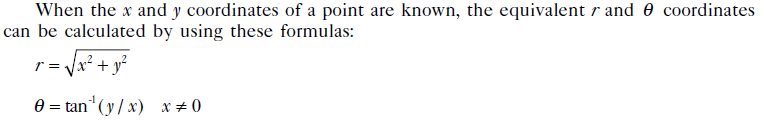
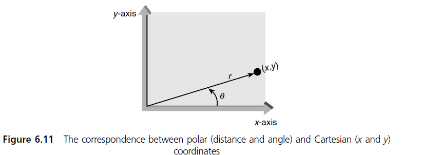

# ELECTRICAL CAT 1

# Instructions
* Do not share your code with anyone else.
* Any malpractice detected in your code will lead to an automatic 0.
* Document your code using either in-code comments or the readme file.
* Ensure to indicate your name, course and registration number in the readme file of your repository.
* Raise your hand and communicate any issues to the TAs responsible during the exam.
* The Test is 45 minutes
* Answer only two questions
* The question in Section A is compulsory
* Choose any one question from Section B

# **Section A**

## COMPULSORY QUESTION

### **Description**
* Tom wants to quickly change any number he types into its corresponding word.
* He is only interested in numbers between 0 and 9 inclusive.
* For example; when he types 1, he wants to get out the word "one"

### Write a function that takes in a number and returns its corresponding word and thus assists Tom.

# **Section B**

## QUESTION 1
### **Description**
 
 

### 1. Write a function that takes in the x and y co-ordinates of a point and computes the polar co-ordinates in form of magnitude and angle.
### 2. Write a function that rounds of the value of the magnitude and angle to 2 decimal places and thus compute the polar co-ordinates rounded to 2-decimal places
       * Note that the angle should be computed in degrees and not radians.

### Question Link
* To attempt this question;
    * Question Link: [Link]()

## QUESTION 2
### **Description**
* Mary wants to compute what day of the week it will be after a given number of days have passed.
* For example, 
	* Given that today is Tuesday. She should be able to know that after 120 days, it will be Wednesday.
	* Given that today is Thursday. She should be able to know that after 20 days, it will be Wednesday. 

### Write a function that takes in two parameters: the day of the week (say d) and a certain number (say n) and returns a string identifying the day of the week n days after d.
 
### Question Link
* To attempt this question;
    * Question Link: [Link]()

## QUESTION 3
### **Description**
     
* Character recognition software is widely used to digitise printed texts. Thus the texts can be edited, searched and stored on a computer.
* When documents (especially pretty old ones written with a typewriter), are digitised character recognition softwares often make mistakes.
* Your task is to correct the errors in the digitised text. You only have to handle the following mistakes:
	-   `S` is misinterpreted as `5`
	-   `O` is misinterpreted as `0`
	-   `I` is misinterpreted as `1`
### Write a function that takes in a string and replaces the errors (numbers) above with the corresponding character. 

### Question Link
* To attempt this question;
    * Question Link: [Link]()
